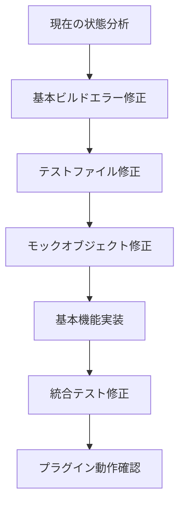

# Design Document

## Overview

この Obsidian プラグインプロジェクトは、Slack メッセージを同期する機能を持つプラ
グインですが、現在多数の TypeScript エラーとビルドエラーにより機能しない状態です
。主な問題は以下の通りです：

1. **型定義の不整合**: テストファイルで使用されているインターフェースやメソッド
   が実装されていない
2. **モックオブジェクトの不完全な実装**: テスト用のモックが実際のインターフェー
   スと一致していない
3. **未実装の機能**: 設計書に記載されているが実装されていない機能が多数存在
4. **依存関係の問題**: Obsidian API の使用方法に問題がある可能性

## Architecture

### 修復戦略



### 段階的修復アプローチ

1. **Phase 1: Critical Build Errors**

   - TypeScript コンパイルエラーの修正
   - 基本的な型定義の整合性確保
   - main.js の正常な生成

2. **Phase 2: Test Infrastructure**

   - モックオブジェクトの型定義修正
   - テストフレームワークの基本機能実装
   - 単体テストの修正

3. **Phase 3: Core Plugin Functionality**

   - プラグインの基本ライフサイクル確保
   - 設定タブの動作確認
   - コマンド登録の確認

4. **Phase 4: Integration Tests**
   - 統合テストの段階的修正
   - 未実装メソッドの基本実装
   - テストカバレッジの回復

## Components and Interfaces

### 修正が必要な主要コンポーネント

#### 1. Mock Objects (テスト用)

- `MockObsidianEnvironment`: 多数の未実装メソッドが存在
- `IntegrationTestFramework`: インターフェースと実装の不一致
- `TestDataGenerator`: 未実装メソッドの追加が必要

#### 2. Core Plugin Components

- `SlackSyncPlugin`: 基本的な実装は存在するが、依存関係に問題
- `PluginSettingTab`: 型定義の修正が必要
- Status 管理系クラス: インターフェースと実装の不一致

#### 3. Type Definitions

- `Result<T, E>` 型の使用方法の統一
- テスト用インターフェースの追加定義
- 未定義の型の追加

## Data Models

### 修正対象のデータモデル

#### SyncResult Interface

```typescript
interface SyncResult {
  success: boolean;
  totalProcessed: number;
  processingTime: number;
  timestamp: string;
  error?: {
    type: string;
    code?: string;
    message: string;
  };
  // filesCreated プロパティを追加
  filesCreated?: number;
  retryCount?: number;
}
```

#### MockSlackMessage Type

```typescript
interface MockSlackMessage {
  id: string;
  text: string;
  user: string;
  timestamp: string;
  channel: string;
  files?: Array<{
    name: string;
    url: string;
  }>;
}
```

## Error Handling

### エラー修正戦略

#### 1. Type Errors

- 未定義プロパティの追加
- 型アサーションの適切な使用
- インターフェース定義の統一

#### 2. Mock Implementation Errors

- 未実装メソッドの基本実装追加
- 戻り値の型の統一
- Promise 型の適切な処理

#### 3. Build Configuration Errors

- TypeScript 設定の最適化
- ESBuild 設定の確認
- 依存関係の整理

## Testing Strategy

### テスト修復アプローチ

#### 1. Unit Tests

- 基本的な単体テストから修正開始
- モックの最小限実装
- 段階的な機能追加

#### 2. Integration Tests

- 統合テストは後回し
- 基本機能確認後に段階的修正
- 未実装機能の仮実装

#### 3. E2E Tests

- 最終段階で修正
- 実際のプラグイン動作確認後
- 必要に応じて簡素化

### テスト実行戦略


## Implementation Priority

### 修正優先順位

1. **High Priority (即座に修正)**

   - TypeScript コンパイルエラー
   - 基本的な型定義エラー
   - main.ts の依存関係エラー

2. **Medium Priority (基本機能確保後)**

   - テストファイルの型エラー
   - モックオブジェクトの基本実装
   - プラグイン設定タブの動作

3. **Low Priority (最終段階)**
   - 統合テストの完全修正
   - 高度な機能のテスト
   - パフォーマンステスト

### 段階的実装計画

各段階で動作確認を行い、次の段階に進む前に安定性を確保する。エラーが多すぎる場合
は、一時的に問題のあるファイルを無効化し、基本機能の確保を優先する。
