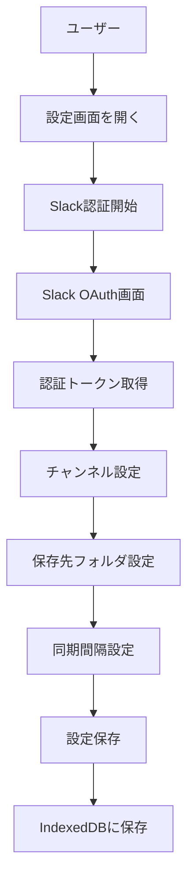
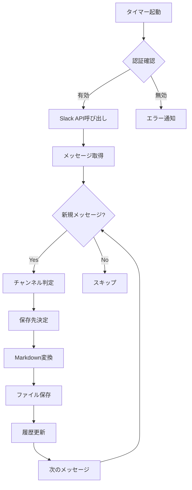
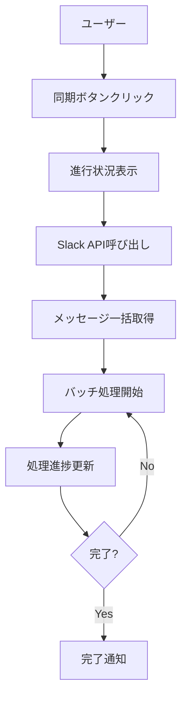
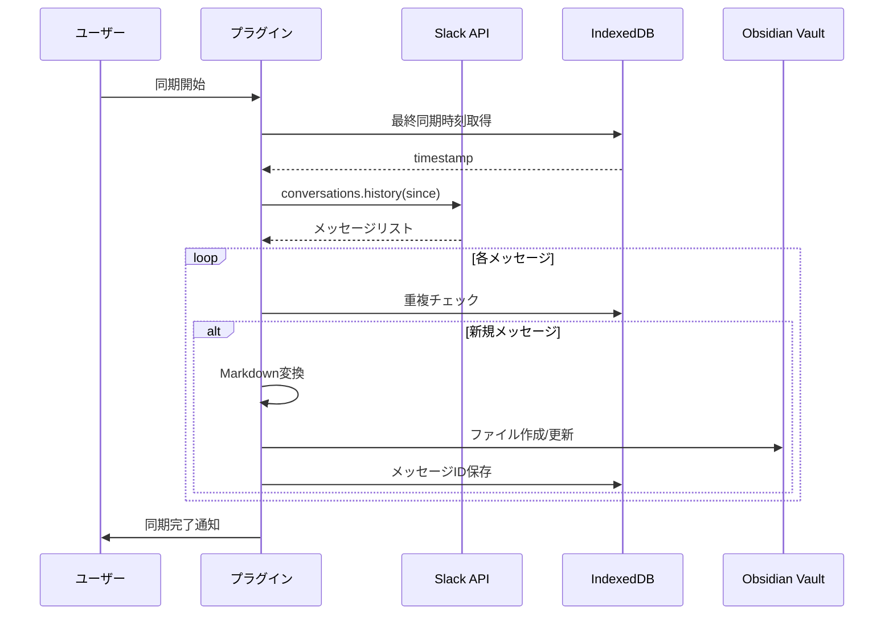
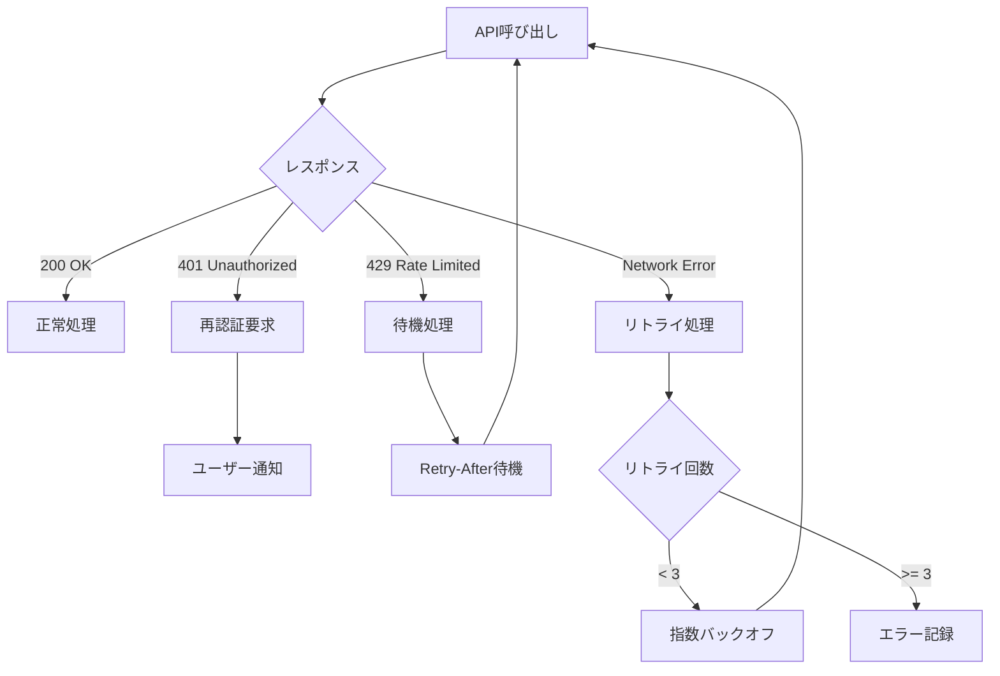
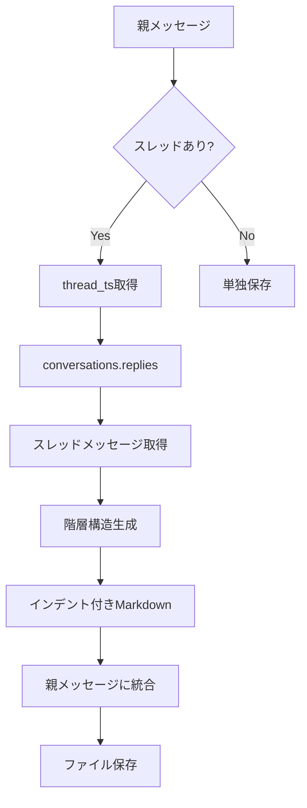
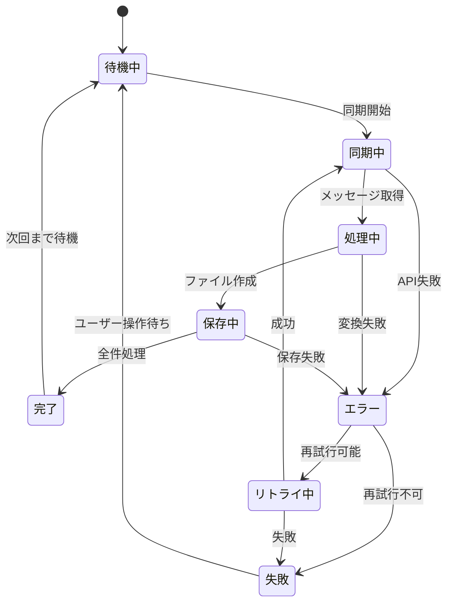

# データフロー図

## ユーザーインタラクションフロー

### 初期設定フロー



### 自動同期フロー



### 手動同期フロー



## データ処理フロー

### メッセージ取得シーケンス



### チャンネル別振り分けフロー

```mermaid
flowchart LR
    A[Slackメッセージ] --> B{チャンネル判定}
    B -->|メモチャンネル| C[/Memos/フォルダ]
    B -->|アイデアチャンネル| D[/Ideas/フォルダ]
    B -->|デイリーノート設定| E[/Daily Notes/YYYY-MM-DD.md]
    B -->|その他| F[/Slack/フォルダ]

    C --> G[個別ファイル作成]
    D --> H[タグ付きファイル作成]
    E --> I[既存ファイルに追記]
    F --> J[チャンネル名フォルダ作成]
```

### エラー処理フロー



## データ変換フロー

### Slack メッセージ → Markdown 変換

````mermaid
flowchart TD
    A[Slackメッセージ] --> B[テキスト抽出]
    B --> C{要素判定}
    C -->|プレーンテキスト| D[そのまま出力]
    C -->|メンション| E[[[user]]形式に変換]
    C -->|リンク| F[Markdownリンクに変換]
    C -->|コードブロック| G[```で囲む]
    C -->|添付ファイル| H[![[file]]形式で参照]
    C -->|絵文字| I[Unicode変換]

    D --> J[結合処理]
    E --> J
    F --> J
    G --> J
    H --> J
    I --> J

    J --> K[メタデータ追加]
    K --> L[最終Markdownファイル]
````

### スレッド処理フロー



## 同期状態管理フロー


